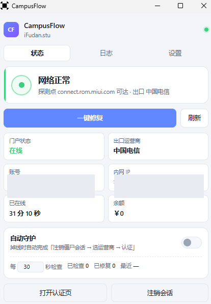

<p align="center">
  
</p>

# CampusFlow

> 复旦大学张江生活组团 `iFudan.stu` 校园网自动认证 · 掉线自动重连

[](https://github.com/To0Ru/CampusFlow/actions/workflows/build.yml)
[](https://github.com/To0Ru/CampusFlow/releases/latest)
[](https://github.com/To0Ru/CampusFlow/releases)
[](#-下载)
[](LICENSE)

回宿舍、休眠唤醒、从校外回来——校园网都要重新认证一遍。
更气人的是打开认证页它还显示"已登录"，但就是没网，必须退出账号重登一次才有用。

CampusFlow 就是为了干掉这个重复劳动：**后台常驻，掉线自动重连，你什么都不用管。**

<p align="center">
  
</p>

---

## ✨ 特性

- **🔁 掉线自动重连** — 后台每 30 秒探测一次，断网自动完成认证
- **🧟 专治「僵尸会话」** — 门户显示在线、实际没网时，自动先注销再重登
- **🎯 自动选运营商** — 电信 / 移动 / 联通 / 校园网，不用每次手点弹窗
- **🖥 原生桌面小程序** — 轻量化程序，托盘常驻，CPU 占用约为 0，内存占用约 4 MB
- **🔒 账号密码加密存储** — 用 Windows DPAPI 加密，配置保存在本地，数据不经任何第三方服务器
- **🚀 开机自启** — 可选，不需要管理员

---

## 📥 下载

到 [**Releases**](https://github.com/To0Ru/CampusFlow/releases/latest) 页面：

| 文件 | 说明 |
|---|---|
| `CampusFlow.exe` | **免安装版**，双击即用，保存配置会写入本地文件（账号密码经 DPAPI 加密），开机自启会写注册表 |
| `CampusFlow_*_x64-setup.exe` | 安装包，当前用户安装，**不需要管理员权限** |

**系统要求**：Windows 10 / 11

---

## 🚀 使用

1. 双击打开
2. 切到「**设置**」页，填用户名、密码，选好出口运营商（默认中国电信）→ 保存
3. 回「**状态**」页，把「**自动重连**」打开
4. 就这样，之后不用再管了

想开机就自动跑，在设置页把「**开机自启**」也打开。

> 自启写的是当前用户注册表 `HKCU\...\CurrentVersion\Run`，不需要管理员。
> 但存的是 exe 的**绝对路径**，所以**挪动程序目录后要重新开启一次**，
> 否则注册表还指着旧位置。

再往下的「**自动退出**」是给“开机连一次就完事”的场景准备的（需先开开机自启）：
开机后等 iFudan.stu 连上、自动认证完，程序直接退出，不在后台常驻。
开着它就等于“每天开机自动连一次网，然后不占你任何东西”。

> **关闭窗口只是收进托盘**，守护还在后台跑。真正退出请点设置页的「退出程序」，或右键托盘图标 → 退出。

**快捷键**：`R` 刷新，`F` 一键连接

---

## ❓ 常见问题

<details>
<summary><b>为什么"打开认证页显示已登录，但就是没网"？</b></summary>

因为认证网关（AC）和认证门户是两套状态。AC 侧的会话已经超时被踢了，门户侧却还记着你在"在线"，于是它一看你在线就直接跳过认证，什么都不做。

**只有先注销清掉那条僵尸记录，重新认证才会真正下发到 AC。** 这就是为什么手动操作时"退出账号重登一次"才有用。

CampusFlow 检测到这种情况会自动帮你做这一步。
</details>

<details>
<summary><b>点了「一键连接」还是不通？</b></summary>

看「日志」页，那里有每一步的详细输出。常见的两种：

- **账号欠费 / 被限制 / 需要二次验证** — 日志会写 `认证返回成功，但外网仍不通`。去 [自助服务系统](http://10.108.255.18:8800/) 查
- **提示"没匹配到运营商"** — 设置里的出口运营商填错了，日志里会列出可选项

</details>

<details>
<summary><b>账号密码是怎么存的？安全吗？</b></summary>

用 Windows 自带的 **DPAPI** 加密后存在 `%APPDATA%\CampusFlow\config.json`。
DPAPI 的密钥由你的 Windows 登录凭据派生，所以加密后的内容**换台机器、换个用户账户都解不开**。
配置里可以看到 `"password": "dpapi:AQAAANCMnd8BFdERjHoAwE..."` 这种形式。

它防的是**意外泄露**：把配置文件发给别人排查、云盘同步、备份软件、同机器上别的账户偷看。

**但它防不住盗号木马**——木马以你的身份运行，调同一个 API 就能解开。这一点得说实话。

> ⚠️ **副作用**：加密后 `config.json` 不能拷到别的电脑用，换机器要重新填一次密码。
> 卸载重装（同一台机器同一账户）不受影响。

</details>

<details>
<summary><b>会被杀毒软件报毒吗？</b></summary>

Tauri 编译出的原生 exe，不是 PyInstaller 打包的，误报率远低于后者。但因为**没有代码签名证书**，个别杀软可能仍会提示"未知发布者"，选择信任即可。

</details>

<details>
<summary><b>能用在别的学校吗？</b></summary>

不能。这套协议是针对复旦 `iFudan.stu` 的门户（`10.102.250.36`）逆向出来的，别的学校认证系统不一样。不过如果你也想适配，[`docs/PROTOCOL.md`](docs/PROTOCOL.md) 里的分析方法可以照搬。

</details>

---

## 🛠 从源码构建

项目**不需要本地装 Rust**，编译全部交给 GitHub Actions。

```bash
git clone https://github.com/To0Ru/CampusFlow.git
cd CampusFlow
```

**日常验证**：推任意分支 → CI 跑 `cargo check` + `cargo build --release`，exe 作为 artifact 上传，在 Actions 页面直接下载。

**发版**：

```bash
git tag v0.1.0
git push origin v0.1.0
```

CI 会额外构建 NSIS 安装包并自动发 Release。

<details>
<summary><b>本地开发（可选）</b></summary>

```powershell
winget install --id Rustlang.Rustup -e
winget install --id Microsoft.VisualStudio.2022.BuildTools -e `
  --override "--quiet --wait --add Microsoft.VisualStudio.Workload.VCTools --includeRecommended"
```

然后：

```bash
cd src-tauri
cargo run          # 调试模式，自动开 devtools
```

</details>

---

## 📖 它是怎么工作的

```
能看到外网 ? ── 是 ──> 什么都不做
      │
      否
      ├─ 门户说在线 ──> 僵尸会话：先注销，再重新认证
      └─ 门户说离线 ──> 直接重新认证

认证分两步（多出口账号才有第二步）：
    firstauth  校验账号密码 → 返回运营商列表
    secondauth 带上选定的运营商 → 真正下发认证
```

协议细节、三个必须避开的坑（紧凑 JSON、GBK 编码、门户劫持）都写在
**[docs/PROTOCOL.md](docs/PROTOCOL.md)**。

### 项目结构

```
src-tauri/src/
├── portal.rs      门户协议：两步认证 / 注销 / 在线查询
├── net.rs         联网探测（不跟随跳转，识别门户劫持）+ 读 WiFi SSID
├── config.rs      配置读写（%APPDATA%\CampusFlow\config.json）
├── fixer.rs       修复编排 + 状态采集
├── watcher.rs     后台守护线程
├── logbus.rs      日志缓冲 + 事件广播
├── commands.rs    前端可调用的命令
├── tray.rs        托盘图标 + 菜单
├── autostart.rs   开机自启（直接写注册表）
└── main.rs        入口

web/               前端（纯静态，零构建，无 npm）
```

**技术栈**：Rust + Tauri v2 · 依赖只有 `tauri` / `serde` / `ureq` / `encoding_rs`

---

## ⚠️ 免责声明

本项目通过逆向校园网认证页面的前端 JavaScript 实现，**仅供个人在自己的账号上自动化重复操作**。

使用前请确认符合你所在学校对校园网的使用规定。作者不对因使用本工具产生的任何后果负责。

---

## 📄 License

[MIT](LICENSE)
